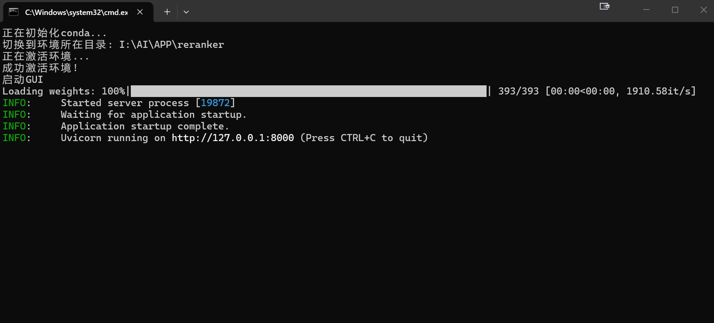

# BGE Reranker API

本工具基于 FastAPI 的本地 BGE 重排序模型推理服务。

由于LM studio/Ollama等常用工具不能完整支持rerank协议，在建立本地知识库时缺少reranker模型会大大降低准确率，本人试过多种方法部署reranker模型均觉得麻烦，遂写了这个脚本，可以CPU/GPU跑reranker模型（其实CPU就够用）。

## 功能特性

- **本地部署**：无需云端服务，保护数据隐私
- **GPU 加速**：支持 CUDA 加速推理
- **混合精度**：采用 FP16 半精度，大幅降低显存占用
- **批量处理**：支持批量文档重排序，最多 30 篇文档
- **兼容性强**：符合 OpenAI-style API 格式，便于集成



## 环境要求

| 项目 | 最低要求 |
|------|----------|
| Python | >= 3.8 |
| 显存 | 16GB (RTX 5060 Ti 或同等规格) |
| 操作系统 | Windows / Linux / macOS |
| CUDA | 11.8+ (用于 GPU 加速) |

## 安装步骤

### 1. 克隆项目

```bash
git clone <your-repo-url>
cd bge_rerank_api
```

### 2. 创建虚拟环境（推荐）

建议安装miniconda创建环境。

python创建环境命令：

```bash
python -m venv venv
source venv/bin/activate  # Linux/macOS
# 或
venv\Scripts\activate  # Windows
```

### 3. 安装依赖

```bash
pip install -r requirements.txt
```

### 4. 下载模型

将 BGE Reranker 模型下载到本地，修改 `bge_rerank_api.py` 中的 `MODEL_PATH`：

```python
MODEL_PATH = r"I:\AI\APP\reranker\models\BAAI\bge-reranker-v2-m3"
```

模型下载地址：
- Hugging Face: https://huggingface.co/BAAI/bge-reranker-v2-m3
- Modelscope: https://www.modelscope.cn/models

## 使用方法

### 启动服务

建议先安装miniconda，修改启动bat内的路径，方便使用

```bash
python bge_rerank_api.py
```

服务将在 `http://127.0.0.1:8000` 启动。

### API 接口

#### 1. 获取模型列表

```
GET /rerank/v1/models
```


## 配置参数

| 参数 | 默认值 | 说明 |
|------|--------|------|
| `MODEL_PATH` | - | 模型本地路径（必须配置） |
| `MAX_LENGTH` | 1024 | 最大上下文长度 |
| `BATCH_MAX_DOCS` | 30 | 单次请求最大文档数 |
| `DEVICE` | auto | 设备选择（cuda/cpu） |

## 性能优化

本项目针对 RTX 5060 Ti 16G 进行了以下优化：

1. **FP16 混合精度**：将模型权重转换为半精度，大幅降低显存占用
2. **批量处理**：支持批量文档处理，提高吞吐量
3. **显存清理**：推理后自动清理显存，防止内存泄漏
4. **CUDA 加速**：启用 GPU 加速，提升推理速度

## 与 Cherry Studio 集成

本 API 兼容 Cherry Studio 的重排序功能配置：

1. 打开 Cherry Studio 设置
2. 进入「模型服务」→「重排模型」
3. 配置 API 地址：`http://127.0.0.1:8000`
4. 选择模型：`bge-reranker-v2-m3`

## 常见问题

### Q: 显存不足怎么办？

A: 尝试减小 `BATCH_MAX_DOCS` 或降低 `MAX_LENGTH`。

### Q: 如何指定其他模型？

A: 下载其他 BAAI 重排序模型，修改 `MODEL_PATH` 路径和 `list_models` 中的模型 ID。

### Q: 支持 CPU 运行吗？

A: 支持，将自动回退到 CPU 模式，但推理速度会显著降低。

## 许可证

MIT License

## 参考链接

- [BAAI/bge-reranker-v2-m3](https://huggingface.co/BAAI/bge-reranker-v2-m3)
- [FastAPI 文档](https://fastapi.tiangolo.com/)
- [Transformers 文档](https://huggingface.co/docs/transformers/)
